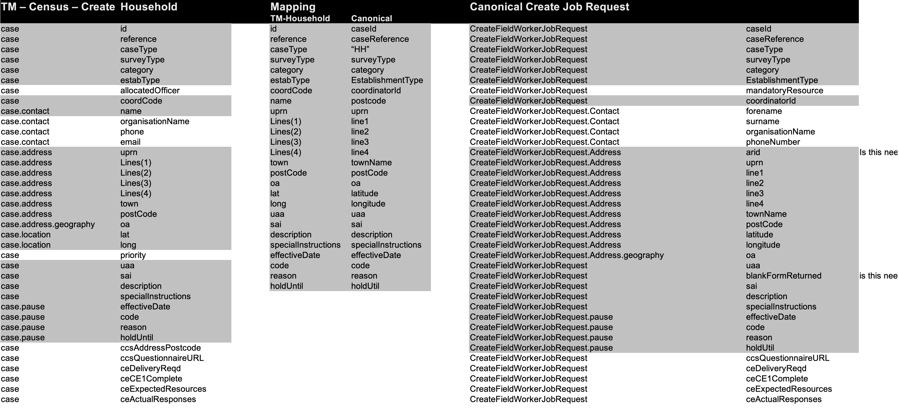
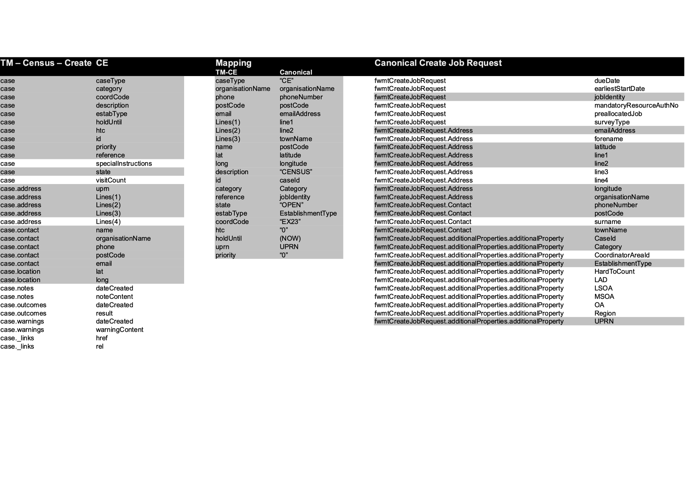
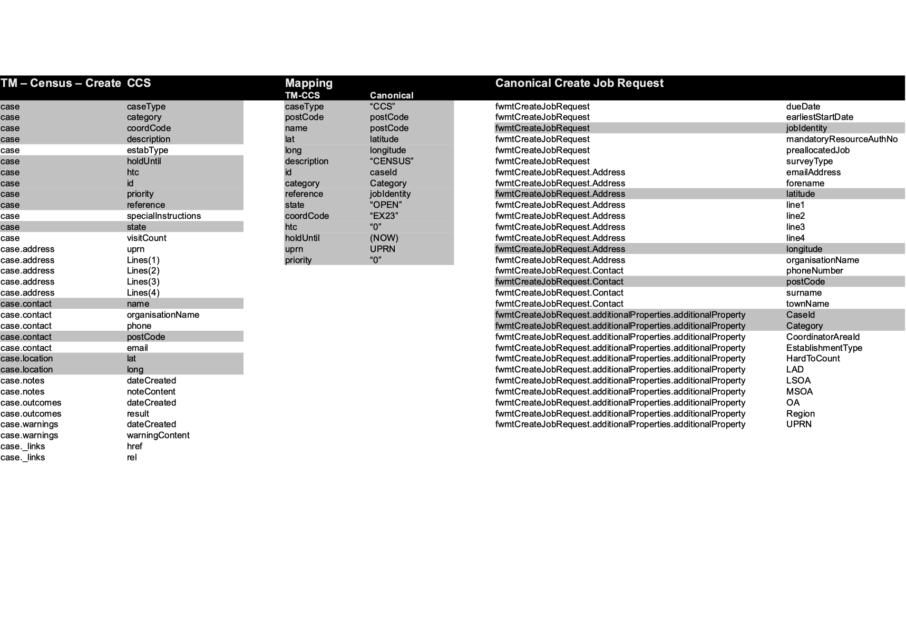
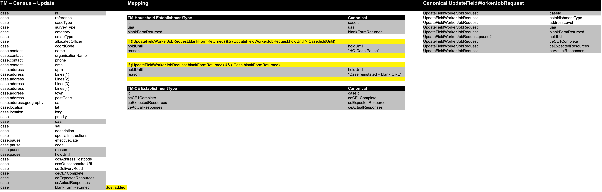

> **THIS REPO IS SEEDED FROM 2021 CODE AND AS SUCH CURRENTLY NEEDS MODERNISATION!** (see also [SEEDING.md](SEEDING.md).)

  

# census31-fwmt-job-service
This service is a gateway between Response Management and Total Mobile's COMET interface.

It takes an Field Worker Job Request Canonical (Create, Update, Canel) message off the Gateway.Actions RabbitMQ Queue and transforms it into a JSON request which is sent to an instance of Tomtal Mobile' COMET endpoint.

	

## Quick Start

Requires RabbitMQ to start:

    docker run --name rabbit -p 5671-5672:5671:5672 -p 15671-15672:15671-15672 -d rabbitmq:3.6-management

To run:

    ./gradlew bootRun

## tm-canonical-hh
 

## tm-canonical-ce

## tm-canonical-ccs

## tm-canonical-update

## Copyright
Copyright(C) 2020 Crown Copyright (Office for National Statistics)
