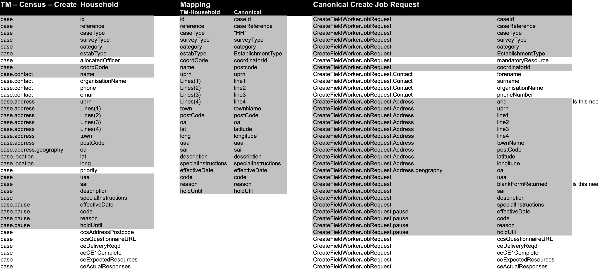
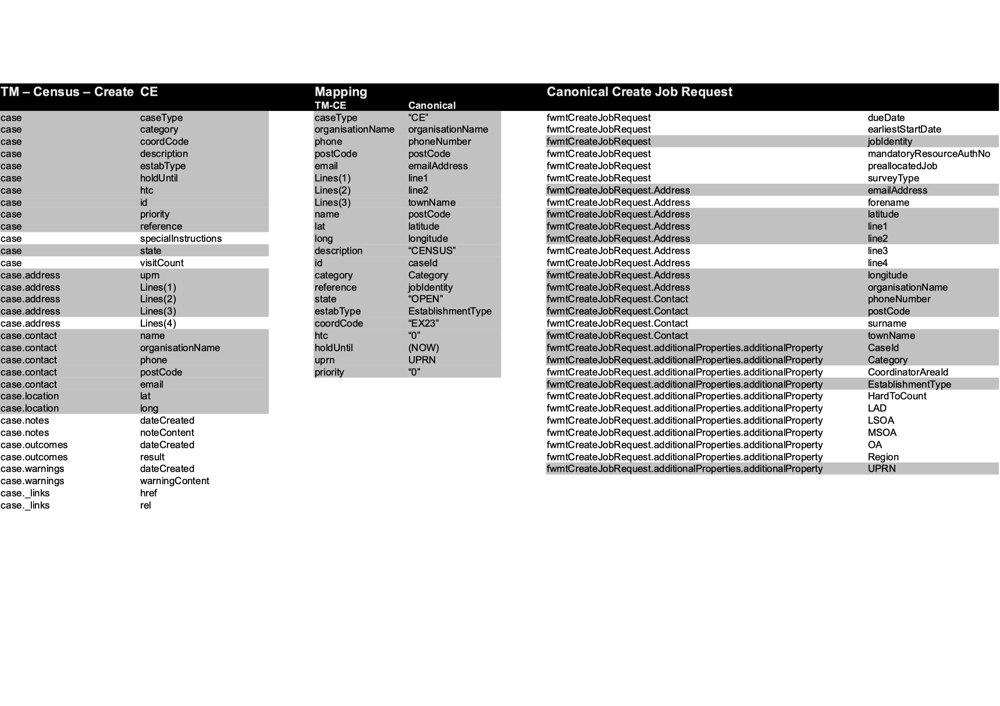
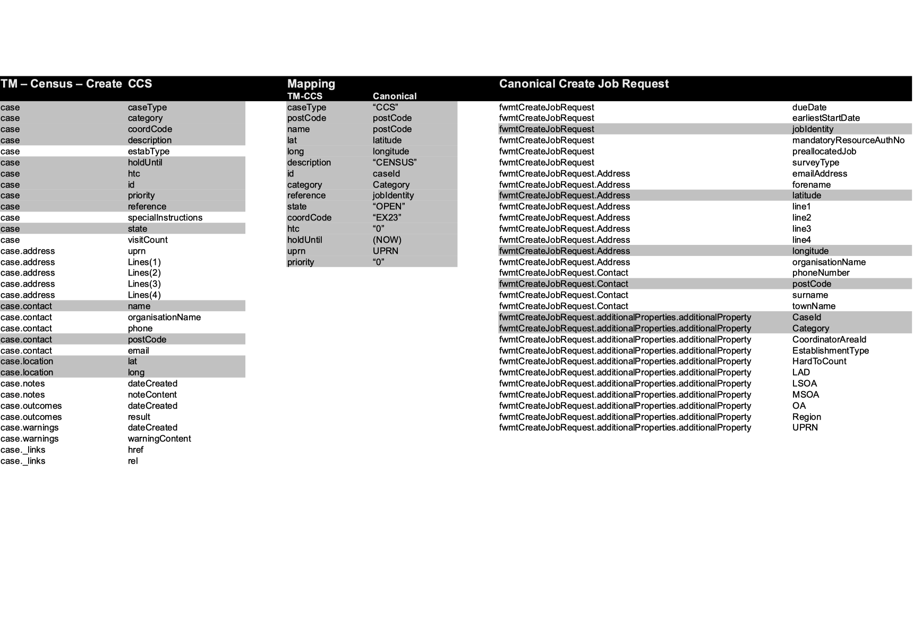
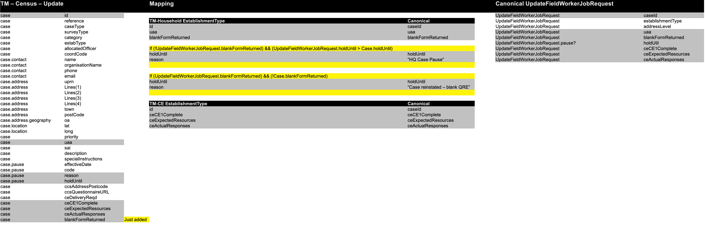

> **THIS REPO IS SEEDED FROM 2021 CODE AND AS SUCH CURRENTLY NEEDS MODERNISATION!** (see also [SEEDING.md](SEEDING.md).)
trigger
# census31-fwmt-job-service
This service is a gateway between Response Management and Total Mobile's COMET interface.

It takes an Field Worker Job Request Canonical (Create, Update, Cancel) message off the Gateway.Actions RabbitMQ Queue and transforms it into a JSON request which is sent to an instance of Tomtal Mobile' COMET endpoint.

	

## Quick Start

Requires RabbitMQ to start:

    docker run --name rabbit -p 5671-5672:5671:5672 -p 15671-15672:15671-15672 -d rabbitmq:3.6-management

To run:

    mvn spring-boot:run

## Pub/Sub Listener Operations

Job Service exposes authenticated controls for pausing and resuming each action-instruction
inbound adapter independently. The application remains running when an adapter is stopped.
The endpoints are protected by the service's HTTP Basic authentication policy in
`WebSecurityConfig`; do not expose them publicly, and use the deployment's managed operational
credentials rather than local defaults.

| Subscription | Stop | Start |
| --- | --- | --- |
| External RM-adapter: `job-service-fieldwork-action-instruction` | `POST /admin/pubsub/fieldwork-action-instruction/stop` | `POST /admin/pubsub/fieldwork-action-instruction/start` |
| Internal FWMT: `job-service-fieldwork-action-instruction-internal` | `POST /admin/pubsub/fieldwork-action-instruction-internal/stop` | `POST /admin/pubsub/fieldwork-action-instruction-internal/start` |

The historical `GET /RM/stopListener` and `GET /RM/startListener` routes remain as
backward-compatible aliases for the external subscription only. New operational automation
should use the `POST /admin/pubsub/...` routes. Repeated stop/start requests are safe and return
success without repeating a lifecycle transition.

These controls stop or start the inbound adapter on the **Job Service instance that receives the
HTTP request**; they do not pause other replicas. For a service-wide pause, invoke the control on
every serving instance or use the deployment platform to coordinate replica-level operations.
The controls do not delete, acknowledge, or drain messages from the subscription. Messages
already delivered to a handler may finish and be acknowledged normally; messages not acknowledged
remain subject to Pub/Sub redelivery. Stopping an adapter does not cancel work already in flight.

For GCP, monitor backlog in Cloud Monitoring using
`pubsub.googleapis.com/subscription/num_undelivered_messages`, filtered by the relevant
`subscription_id` (the external or internal subscription above). Check each subscription
separately; a stopped adapter does not imply that other replicas or consumers have stopped.
Acceptance-test queue reset must not call these operational controls.

## tm-canonical-hh
 

## tm-canonical-ce

## tm-canonical-ccs

## tm-canonical-update

## Transition Architecture Notes

See `docs/transition-strategy-architecture.md` for resolver/strategy execution design,
runtime sequence, and migration notes for the Transitioner refactor.

## Copyright
Copyright(C) 2020 Crown Copyright (Office for National Statistics)

Trigger on branch 3
